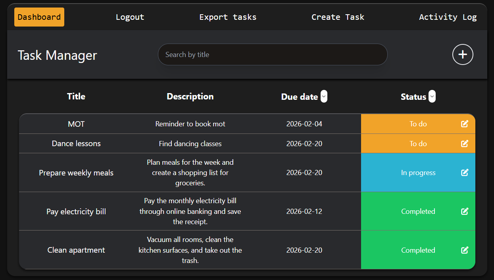
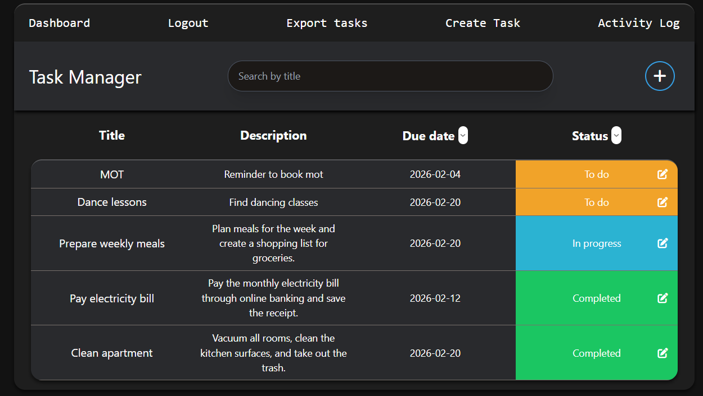
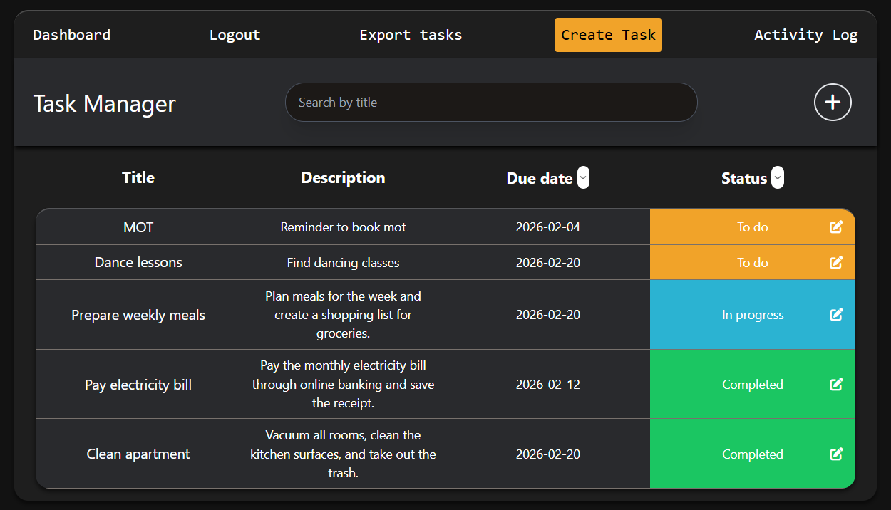
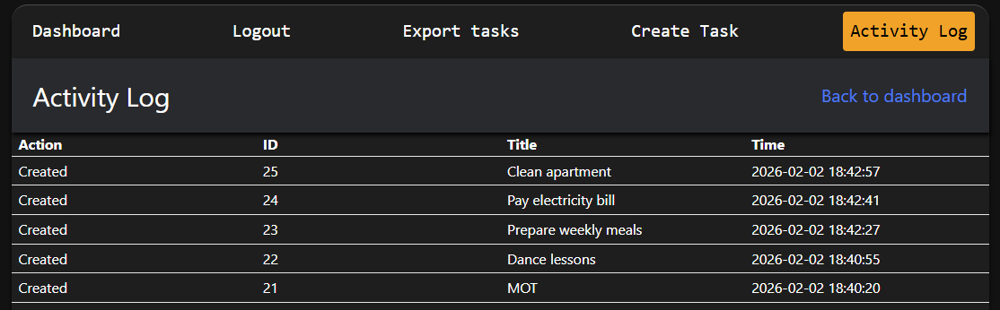

# ITOL Final Project — Task Manager (Flask + SQLite)

A full-stack task manager built with Flask, SQLite, Tailwind, and Resend email.  
Features: authentication, task CRUD, task filtering/sorting UI, CSV export, activity log, password reset, and cron-triggered due-date reminders.

## Features
- Register / Login / Logout
- Create, edit, delete tasks (per-user ownership enforced)
- Dashboard search + sort (by due date) + filter (by status)
- Activity log (last 50 actions)
- Export tasks to CSV
- Password reset via email link (single-use token + expiry)
- Cron endpoint to send due reminders

## Tech Stack
- Python (Flask)
- SQLite
- Tailwind CSS (CDN)
- Resend (email)
- Javascript

## Setup (Local)
1) Clone + create virtualenv
```bash
git clone https://github.com/Sosenaa/ITOL-Final-Project.git
cd ITOL-Final-Project
python -m venv .venv
# Windows:
.venv\Scripts\activate
# Mac/Linux:
source .venv/bin/activate
```

2) Install dependencies
```bash
pip install -r requirements.txt
```

3) Create .env
Copy .env.example to .env and fill values:
```bash
copy .env.example .env
```

4) Run
```bash
python app.py
```
Open: http://127.0.0.1:10000

## Notes
- The database is created automatically on startup via `create_tables()`.

## Live demo
- https://itol-final-project.onrender.com/register 
 
 
### Screenshots 

### Dashboard 


### Task can be created by clicking on "Create Task" and "+"



### Create Task View


### Activity Log
